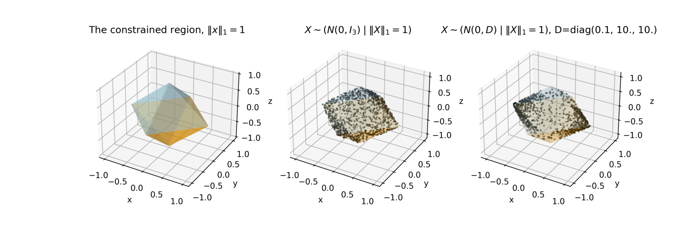

# Introduction

Our motivation comes from a question that arose when modeling dicot
(e.g. maize) root growth in a piecewise linear fashion and inferring
the path of a root given a point along its trajectory.

In its simplest form, the question is the following.  Suppose that a
priori $X \sim N(\mu, I_n / \phi)$.  Subsequently, we learn that
$\ell(X) = 0$ where $\ell$ is a piecewise affine,
continuous function.  How does one sample $(X | \ell(X) = 0)$?
We can, of course extend that to when the covariance is any positive
definite symmetric matrix $\Sigma$.

This software can sample from these sorts of distributions.  It uses
Hamilton Monte Carlo (HMC).

Please note though, that the excellent HMC software
[Stan](https://mc-stan.org/) can often sample from a nearly identical
distribution - so long as $\ell(x)$ is not too complicated - by
insisting that $|\ell(x)| < \varepsilon$.  In other words, you should
check out Stan to see if you use-case fits there before diving into
this software.


# Example

For instance, this software allows us to sample from 

$$X \sim (N(0, D) \; | \; ||X||_1= 1)$$ 

as seen below.  We are not restricted to diagonal $D$ and can use arbitrary
covariance structures.  (Actually, we can use piecewise quadratic
log-densities.)




# Parameterization

There are two classes of main interest depending on if the covariance
structure is isotropic or anisotropic.  Those are
`IsotropicCTGauss` and `AnisotropicCTGauss`, respectively.
Both of these using the same parameters to define the function
$\ell(x)$.


## Defining $\ell(x)$

There are two parts to defining $\ell(x)$, defining the regions and
defining the subspace within each region.


### Defining the regions

The regions are defined using

- (m, n) array $F$
- (m, 1) or (m,) array $g$
- (J, m) array $L$

The $i$ th row of $F$ and $i$ th entry of $g$ define a hyperplane via $f_i'
x + g = 0, i = 1, \ldots, m.$

The jth row of $L$ defines how to construct the jth region, for
$j = 1, \ldots, J$.  The rules are

- The $i$ th hyperplane is used (is active) in constructing the jth
  region if $L_{ji} \neq 0$.
- The jth region is defined by 
  $$sign(L_{ji}) ({f_i}' x + g_i) \geq 0$$
    
  for active $i$.
- If a particle in region $j$ encounters the $i$ th hyperplane, the
  magnitude of $L_{ji}$ determines to which region it transitions.  In
  other words, for active $i$, the particle is reflected if $|L_{ji}|
  = j$, otherwise it passes through the hyperplane innto region
  $|L_{ji}|$.


### Defining the subspaces

The subspaces are defined using

- (J, n, d) array or a list of J (n, d) arrays $A$
- (J, d) array or a list of J (d,1) or (d,) arrays $y$

For the $j$ th region, the subspace is $$A[j]'x + y[j] = 0.$$


## Gaussian parameters

In the isotropic case, the parameters are

- The mean $\mu$ as an (n,1) or (n,) array
- The precision $\phi$ as a scalar

In the anisotropic case, the parameters are given by

- The mean $\mu$ as an (n,1) or (n,) array
- The precision $M$ as a (n, n) array


# Example

After defining the function $\ell$ via the parameters describe above,
you can generate samples by using the `sample` function.  E.g.:

```
  import numpy as np
  from ctgauss import IsotropicCTGauss

  # ... Define A, y, F, g, L ...
  
  rng = np.default_rng()
  N = 1000                       # Draw 1000 samples
  t_max = np.pi / 2              # Travel pi/2 before resampling momentum

  # Make sure these values correspond to your \ell!!!
  x0 = np.array([1., 0., 0.])    # The starting point
  x0dot = np.array([0., 1., 0.]) # The staring velocity
  reg = 1                        # The starting region

  ictg = IsotropicCTGauss(phi, mu, A, y, F, g, L)
  (X, Xdot, R) = ictg.sample(rng, N, t_max, reg, x0, x0dot)
```

More specific examples can be found in the `notebooks` directory.
